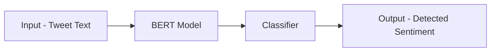

# Evaluation of the Effectiveness of Different ML Models on Detecting Cyber Harassment
> Jin Seok Park, Andrew Chung

People use social media and the internet on a day-to-day basis, including a vast majority of students (children and teenagers). 
With the rise of COVID-19 and more people spending time online, cyberbullying has reached an all time high. Since we are college students, 
we thought that this was a serious and significant topic to look deeper into. Through models such as kNN, Decision Tree, Logistic Regression, and 
other transformer models such as BERT, we use data from Kaggle to train our models and classify cyberbullying and non-cyberbullying on the internet.

## Background

To address this issue of cyber harassment, a study was done in 2015 by B. Sri Nandhini and J.I. Sheeba, where they used the FuzGen learning algorithm (uses the adaptive component of the system by means of a GA with fuzzy set genes) and Naïve classifier technique (a classification technique based on Bayes' Theorem with an independence assumption among predictors). The proposed framework consisted of data pre-processing, feature extraction (adjectives, nouns, verbs of similar topics), the FuzGen learning algorithm which models adaptive and exploratory behavior, and the Naïve Bayes Classifier for classifying bullying and non-bullying. Their proposed rules yielded high results: higher than 87% for accuracy, F1-measure, and recall. However, this study used text data from myspace.com and formspring.me, which are outdated websites. The way people communicate on the internet has changed over time; these models are trained on older diction that may not accurately depict classification of newer words. 

Another study was done in 2021 by Aditya Desai, Shashank Kalaskar, Omkar Kumbhar, and Rashmi Dhumal, where they used a dataset from Twitter, now X, to evaluate sentiment analysis and cyberbullying classification on different ML models. Their proposed framework consisted of using SVM, Naïve Bayes, and BERT-base models. Text vectors were created through TF-IDF. An input would be fed to the BERT-base model, which will then be classified by SVM and Naïve Bayes, which will provide an output, being a detected sentiment and further classifying whether a text is cyberbullying.

Their pre-trained BERT model held an accuracy of 70.89% and 91.9% for testing and training sets, respectively. Although this provides high results, we are looking to classify with different techniques. Firstly, we will be using word-embedding (Word2Vec) instead of TF-IDF, as we are looking to understand meaning and context of words in the dataset instead of identifying the relevancy of the words. Furthermore, we will be using text classification instead of sentiment analysis as we are looking for a simple binary output (either cyberbullying or non-cyberbullying) instead of specifying what type of cyberbullying it is. Lastly, we are planning to use K-Nearest Neighbors, Decision Tree, Logistic Regression, and more transformer based models (different variations of the BERT-base model). Our approaches for this issue are different, and thus, can yield different and interesting results.

## Methods

Since we are looking to classify cyberbullying and non-cyberbullying in a binary fashion, we looked into six ML models appropriate for this study: K-Nearest Neighbors, Decision Tree, Logistic Regression, BERT-base, RoBERTa-base, TwHIN-BERT-base.

**K-Nearest Neighbors**
- K-Nearest Neighbors, often abbreviated as KNN, is a non-parametric supervised learning model that classifies or predicts an individual point or a group of points based on proximity to other points in the dataset. The name is derived from choosing a value k, such that k depicts the number of nearby values that would be taken into consideration when classifying. For a binary classification problem like this one, KNN would look into nearby points and increment the respective counts of classifications. Afterwards, KNN would predict that the point has the same classification as the majority group. Due to this, it is important to select an odd value for k, as this can break ties when counts are equal.

**Decision Tree**
- Decision Tree is also a non-parametric supervised learning model used for classification and regression, where rules are created from different features of the dataset to create a model of decisions and their possible consequences, including chance event outcomes, resource costs, and utility. The model’s hyperparameters include minimum leaf samples and maximum depth; with these two combinations, an ideal size for a decision tree can be found to most accurately perform binary classification.  

**Logistic Regression**
- Logistic Regression is a supervised learning model that makes use of logistic functions to predict the probability of a binary outcome. It computes a sum of the input features (in most cases, there is a bias term), and calculates the logistic of the result. Since the output of a logistic regression is between 0 and 1, it is suitable for a binary classification task. The model’s hyperparameters include solvers, penalties, learning rate (C), class weights, and max iterations.

**BERT-base**
- BERT is a pre-trained language model based on Transformer architecture. The model is pre-trained on a large corpus and is able to be fine-tuned for many different types of tasks, such as semantic analysis, question answering, named entity recognition, and many other common NLP tasks. BERT-base is the smaller of the two BERT models, but both models are trained in the same way. Rather than training a completely new model from scratch, BERT is a model that has already been pre-trained on the Book corpus, as well as Wikipedia. It utilizes Masked Language Modelling and Next Sentence Prediction to gain deep understanding of relationships between words and sentences, allowing it to do a multitude of tasks. To fit to specific tasks wanted by the user, the model solely needs to be fine-tuned in order to fit the requirements of the problem that one is trying to solve. 

**RoBERTa-base**
- RoBERTa is a pre-trained language model that is an improved version of the original BERT model. It was trained on a much larger data corpus, amassing over 160GB of data. It also trains without the usage of NSP and utilizes a dynamic version of MLM, training on longer sequences and more epochs. In most cases, RoBERTa tends to outperform BERT on many common NLP tasks. The overall usage of RoBERTa stays similar to BERT, as it is also a large-pretrained model that needs to be fine-tuned rather than being trained from scratch. 

**TwHIN-BERT-base**
- TwHIN-BERT-base is a BERT model that has been pre-trained on the Twitter corpus, and functionally is not different from BERT, as it follows the same model architecture.

## Results

In order to evaluate the models, we utilized accuracy, precision, recall, and F1 scores for accurate and clear comparison. As we utilized a dataset with equal division of each of the classifications, accuracy was used as a measure of model performance. We also utilized F1 scores to get  perspective  on  incorrectly   classified classes. Precision was used to check how correct the model was when predicting the target class. Recall was used to show whether a model could find all objects of the target class.  AUROC was utilized to visualize the performance of the models based on the rate of accuracy in relation to the effectiveness of the binary classification. For simplicity, we show F1 score (representing precision and recall), accuracy, and AUROC scores in the table below:

| Model | Accuracy | F1 score    | AUROC |
|-------|----------|-------------|-------|
| KNN   | 79%      | 74%/82%     | 0.87  |
| DT    | 85%      | 85%/84%     | 0.90  |
| LR    | 64%      | 67%/59%     | 0.66  |
| BERT  | 99%      | 99%/99%     | 0.99  |
| RoBERTa | 99%    | 99%/99%     | 0.99  |
| TwHIN | 99%      | 99%/99%     | 0.99  |
> Table representing the accuracy, F1 score for both of the classes (no cyberbullying on the left, cyberbullying on the right) and the AUROC score. This was utilized for performance evaluation.

From the six models, it is evident that the three transformer models vastly outperform the other three other classification models. The transformer models reach an accuracy of 99% respectively, with Decision Tree and KNN falling slightly short at 85% and 79% accuracy respectively. By far the worst performing model was Logistic Regression, giving both the worst accuracy and F1 scores of all six models. In general, the transformer models give the most consistent and accurate results from when tested on the Kaggle dataset.

> For a more in depth explanation of hyperparameter tuning, ROC curves, and results/conclusions, please take a look at the project final report!

## Project Final Presentation
Click here to check out our final presentation for the project:
 
 

## Project Final Report
Click here to check out our final report for the project:
 
 

